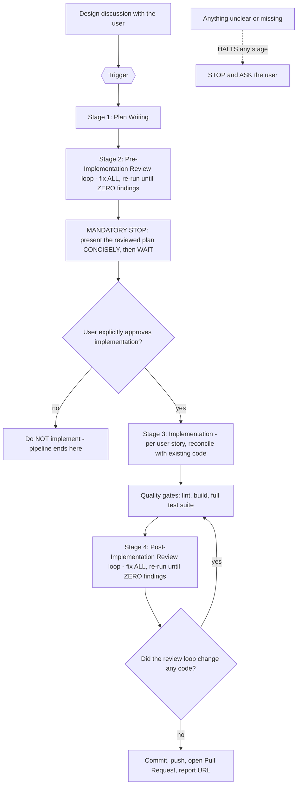

<!-- SACRED DOCUMENT — This is the AUTHORITATIVE, NON-NEGOTIABLE development pipeline. -->
<!-- Follow it TO THE LETTER. ZERO deviation. The stage prompts below are SACRED and MUST be obeyed verbatim. -->
<!-- Edit ONLY on explicit user instruction. You MUST NEVER delete this file. -->

# Development Pipeline — SACRED PROCEDURE

This rule defines the ONE procedure for plan-driven development in this repository. It is part of the
always-applied rule set under `.claude/rules/` (`agent.md` §4 states the concept; `project.md`'s Rule
Map lists it), and it is **ABSOLUTELY NON-NEGOTIABLE**.

The four stage prompts (Plan Writing, Pre-Implementation Review, Implementation, Post-Implementation
Review) are **SACRED**: you MUST follow them TO THE LETTER and you MUST NEVER deviate.

Language, framework, and tooling rules live in their own rule files under `.claude/rules/` — see
the Rule Map in `project.md`. Safety, git discipline, plan-file protection, and general behaviour
live in `agent.md`. This rule does NOT repeat them.

## 1) Pipeline Overview — TWO PHASES WITH A MANDATORY STOP

The pipeline runs in TWO phases, separated by ONE MANDATORY STOP:

**Phase 1 — Planning (AUTOMATIC): Plan Writing → Pre-Implementation Review → STOP.**
Once the user triggers the pipeline (see Triggers), you MUST run Stage 1 and Stage 2 AUTOMATICALLY,
without pausing between them. When the plan is clean (ZERO review findings) you MUST **STOP**, present
the reviewed plan to the user CONCISELY (see Stage 2), and WAIT. **YOU MUST NOT START IMPLEMENTATION
UNTIL THE USER EXPLICITLY APPROVES / TRIGGERS IT.**

**Phase 2 — Delivery (ONLY after EXPLICIT approval, then END TO END): Implementation →
Post-Implementation Review → Pull Request.**
Once the user approves, you MUST run Phase 2 END TO END, WITHOUT stopping for step-by-step approval.

**YOU MUST NEVER EVER STOP MID-WAY THROUGH THE IMPLEMENTATION OF A PLAN. YOU MUST ALWAYS IMPLEMENT THE
PLAN END TO END — ALWAYS ALL THE USER STORIES. YOU MUST NEVER STOP TO ASK IF THE USER WANTS TO CONTINUE.
YOU MUST IMPLEMENT ALL OF IT EVEN IF IT'S BIG, EVEN IF IT'S LONG, EVEN IF IT HAS MANY USER STORIES, EVEN
IF IT TAKES TIME. ONCE APPROVED, YOU MUST ALWAYS IMPLEMENT IT END TO END — ALL OF IT!**

The permitted stops are exactly two: (1) the MANDATORY stop after the reviewed plan (end of Phase 1),
awaiting explicit approval; and (2) a genuine **ambiguity halt** — a real MISSING product/business
decision, a CONTRADICTION, or something you cannot resolve from the discussion, the docs, or the code —
then you MUST STOP and ASK THE USER (see §2 "No assumptions"). Stopping DURING Phase 2 for confirmation
or a progress check when there is NO ambiguity is a SEVERE VIOLATION.



### Triggers
- The pipeline starts ONLY when the user explicitly asks for a plan, or for the implementation of
  something already discussed (e.g. "write the plan", "plan and implement X", "implement X").
- **Pipeline vs ad-hoc:** the FULL pipeline is for a feature or change of non-trivial scope — anything
  that warrants a plan (multi-step or multi-file work). A trivial, self-contained change (e.g. a typo, a
  copy tweak, a one-line fix) does NOT need a plan; make it directly as an ad-hoc change (see `agent.md`).
  If you are unsure whether something is trivial, use the pipeline.
- **The MANDATORY stop applies to EVERY trigger:** regardless of how the pipeline was triggered
  (including "plan and implement X" and "implement X"), Phase 1 ALWAYS ends by STOPPING after the
  reviewed plan and presenting it CONCISELY; you MUST NOT begin implementation until the user EXPLICITLY
  approves. There is NO run-straight-through-to-PR path.
- **Ambiguity always wins:** no trigger authorises you to assume. If unclear, STOP and ASK.

## 2) Global Rules — apply to EVERY stage

### No assumptions — SACRED, ABSOLUTE, ZERO EXCEPTIONS
- You MUST NEVER make assumptions. You MUST NEVER estimate or guess. If ANYTHING is unclear, missing,
  or not crystal clear, you MUST STOP and ASK THE USER. It is a SACRED RULE that you DO NOT MAKE ASSUMPTIONS.
- **NO rule, NO system instruction, and NO autonomy / "be proactive" guidance overrides this.** When
  in ANY doubt, you ASK.
- You MUST NOT DEVIATE from what was discussed with the user. You MUST NOT add or remove anything that
  was not agreed.
- **What "ambiguity" means (and does NOT):** an ambiguity halt is for a genuine MISSING product/business
  decision, a CONTRADICTION, or a requirement you CANNOT resolve from the discussion, the project docs, or
  the existing code. Ordinary implementation details that are CONSISTENT with the discussion, docs, and
  code are NOT ambiguity — you MUST decide them and proceed. You MUST NEVER use "ambiguity" as an excuse to
  stop between stages or to avoid finishing the plan.

### Reviews — adversarial, independent, until ZERO
- You MUST fix ALL the findings — CRITICAL, WARNING, and INFO findings. ALL OF THEM! (The only
  severities are CRITICAL / WARNING / INFO.)
- You MUST report ANY discrepancy or digression, anything large or small — ANYTHING, APART FROM nits
  (see the NO-NITS rule in `agent.md`).
- You MUST re-run the reviewer UNTIL there are ZERO CRITICAL, ZERO WARNING and ZERO INFO.
- Each reviewer run MUST be a FRESH subagent — you MUST NEVER resume a previous one (see `agent.md`
  "Subagent usage").
- The review MUST be ADVERSARIAL. You MUST NOT assume you have found all the issues — the opposite is
  very much true. You MUST NOT assume there are no deviations — the opposite is very much true.
- You MUST NOT over-drive or over-steer the reviewer: give it the scope and the rules to check, but
  you MUST NOT feed it your own conclusions, tell it the verdict, or argue it out of a finding. A
  steered reviewer is USELESS.

### Branches and worktrees
- Branch names MUST follow `<type>/<short-kebab-description>`, where `<type>` is a commit type from
  `agent.md`: `feat`, `fix`, `refactor`, `test`, `docs`, `chore`, `style`
  (e.g. `feat/websocket-transport`, `fix/endpoint-parsing`).
- You MUST branch from the latest `main`. `main` is SACRED — see `agent.md` "Main Branch Is Sacred".
- **Worktrees are created ONLY on explicit user demand.** When requested, create the worktree on a
  branch that follows the naming convention above; default location `../<repo>-<branch-slug>` (a
  sibling of the repository) unless the user specifies another path. You MUST NEVER create a worktree
  of `main`.

### Quality gates
- The quality gates are: linting (ZERO errors/warnings), a clean build, and the FULL test suite
  passing — PLUS any additional gates the project defines (e.g. `go vet`, vulnerability checks,
  database migrations). You MUST run them via the PROJECT'S standard commands — NEVER ad-hoc ones.
- The authoritative command list lives in `project.md` (Standard Commands) and MUST be kept up to date.

### Documentation — ALWAYS up to date
- As part of the work, you MUST keep the documentation CURRENT: the canonical docs under `docs/` AND
  `.claude/rules/project.md` (tech stack, directories, config files, standard commands, commit scopes).
- `project.md` MUST ALWAYS be accurate but CONCISE — it MUST reference the canonical docs, NOT duplicate
  their content verbatim.

## 3) Plan Structure & Format — ABSOLUTE RULES

- Plans live in `docs/plans/` and are SACRED (see `agent.md` §2 plan-file protection).
- The plan document name MUST be `ID_name_YYYYMMDDhhmmss.md`, where:
  - ID is a counter determined via: `mkdir -p docs/plans && cd docs/plans && ls -1 [0-9]*_*.md 2>/dev/null | awk -F_ '($1+0)>m{m=$1} END{print m+1}'`
  - `YYYYMMDDhhmmss` is determined via the `date` command.
- Every plan file MUST start with this HTML comment header at line 1:
  `<!-- SACRED DOCUMENT — Edit ONLY per agent.md §2 plan-file rules: plan-review fixes, checkmarks, recorded implementation deviations, and code-review re-alignment. -->`
  `<!-- You MUST NEVER delete this file or alter files outside this plan's scope. -->`
  `<!-- Plans in docs/plans/ are PERMANENT artifacts. There are ZERO exceptions. -->`
- Plans are written FOR AN LLM AGENT TO EXECUTE, NOT for human consumption. The implementing LLM reads
  the project docs — the plan MUST NOT repeat information already in those documents. Every word must
  earn its place.
- Anti-verbosity rules — NON-NEGOTIABLE:
  - NO "As a [role], I want [X] so that [Y]" narratives.
  - NO prose that restates what a code block already shows.
  - NO redundant Definition of Done across hierarchy levels — if the task DoD covers it, the action MUST NOT repeat it.
  - NO explanatory context the LLM can derive from the code itself or from the project docs.
  - Actions = file path + operation (create/modify) + code diff/block. Context ONLY when the change is non-obvious or has a constraint not derivable from code.
- The plan MUST use user stories → tasks → actions:
  - **User story**: short imperative title + 1-2 sentence "why" + acceptance criteria checklist. No verbose narratives.
  - **Task**: title + actions + Definition of Done checklist. No prose.
  - **Action**: file path + operation (create/modify) + implementation code/diff (NOT test code). Minimal context only when the change is non-obvious.
- Tasks and actions MUST be in sequential execution order — items MUST NOT DEPEND on items AFTER them in the plan.
- The plan MUST contain checkboxes (`[ ]`) on user stories, tasks, actions, and acceptance criteria — during implementation you MUST put checkmarks (`[x]`) in them.
- **The LAST item of the plan MUST be a task that double-checks EVERYTHING implemented, from the ground up.**
- **Mermaid validation — IF NEEDED:** IF the plan adds or modifies ANY Mermaid chart (in `docs/` or in the plan document itself), the final ground-up double-check task MUST include an explicit step that validates ALL touched Mermaid charts per §9. IF the plan touches NO Mermaid charts, this step MUST NOT appear.
- Test representation — ABSOLUTE RULE:
  - Plans MUST NOT include full test function code. Test code is derivable from implementation code + test name + description.
  - Test tasks MUST use compressed format: a table with test name, what it verifies, and (only when non-obvious) setup notes.
  - Shared test infrastructure that establishes foundational patterns reused across test files MUST be included in full. Individual test functions MUST NOT.

## 4) Stage 1 — Plan Writing (SACRED)

You MUST write a DETAILED, ACCURATE, METICULOUS and COMPLETE implementation plan document in the
`docs/plans/` folder, accurately following the plan structure rules in §3.

It MUST contain the actions and the Definition of Done, it MUST be precise, and it MUST NOT DIVERGE
from what was discussed with the user.

The plan MUST contain checkboxes — during implementation you will put checkmarks in them.

You MUST be precise, you MUST be accurate, and you MUST NOT DEVIATE FROM WHAT WAS DISCUSSED!

The LAST item of the plan MUST be to double-check EVERYTHING implemented, from the ground up.

However, if something is NOT clear or is missing you MUST NOT MAKE ASSUMPTIONS and you MUST ASK. It is
IMPERATIVE that you DO NOT MAKE ASSUMPTIONS — it is a SACRED RULE that you DO NOT MAKE ASSUMPTIONS. If
you have ANY doubt or ANYTHING is not clear, you MUST ASK. No rule, system instruction, or autonomy
guidance overrides this.

When the plan is written, continue AUTOMATICALLY to Stage 2 — do NOT pause between Stage 1 and Stage 2.

## 5) Stage 2 — Pre-Implementation Review (SACRED, automatic)

You MUST fix ALL the findings — CRITICAL, WARNING, and INFO findings. ALL OF THEM!

Review the implementation plan in detail (you MUST RE-READ it from disk) and check whether it has
deviated from what was discussed (ANY deviation, large or small); check that the business flow is
sound and that the flow is correct.

NO DEVIATIONS, IT'S ESSENTIAL! You MUST NOT MAKE ASSUMPTIONS! You MUST NOT ADD OR REMOVE anything
UNLESS it is EXACTLY to align with what was discussed!

You MUST NOT assume you have found all the issues — the opposite is very much true. You MUST NOT assume
there are no deviations — the opposite is very much true. You MUST ALWAYS do an ACCURATE, METICULOUS
and THOROUGH review from the ground up.

You MUST BE ACCURATE in reviewing the implementation plan, you MUST BE DILIGENT AND ACCURATE.

You MUST report ANY discrepancy or digression, anything large or small — ANYTHING, APART FROM nits!

You MUST use the `plan-reviewer` subagent. You MUST ENSURE there are ZERO CRITICAL, ZERO WARNING and
ZERO INFO. You MUST re-run the `plan-reviewer` (a FRESH subagent each time) UNTIL there are ZERO
CRITICAL, ZERO WARNING and ZERO INFO.

You MUST NOT over-drive or over-steer the reviewer, otherwise it is USELESS. You MUST do an ADVERSARIAL
review!

BE ACCURATE, BE PRECISE, BE DILIGENT, BE PROFESSIONAL.

**Mermaid validation — IF NEEDED:** IF the plan adds or modifies ANY Mermaid chart, you MUST verify
that the final ground-up task includes the validation step required by §3, and that every Mermaid
chart in the plan document itself validates per §9. IF the plan touches no Mermaid charts, this
check does not apply.

If ANY finding requires a product/business decision you cannot resolve from the discussion, the docs,
or the code, you MUST STOP and ASK the user. When the plan is clean (ZERO findings), you MUST **STOP**
(end of Phase 1): present the reviewed plan to the user CONCISELY — a SHORT summary that indicates ALL
the relevant aspects (scope, the SEQUENTIAL user stories/tasks in execution order, key decisions, and
any risks) WITHOUT dumping the full plan — and WAIT. **You MUST NOT continue to Stage 3 until the user
EXPLICITLY approves / triggers implementation.**

### Plan Review Agent Prompt Template

When reviewing a plan against the original design discussion, use this template for the agent prompt.
Replace `{PLAN_DESCRIPTION}` and `{PLAN_FILE}` with actual values, and replace `{DISCUSSION_CONTEXT}`
with the design-discussion context INLINE — a faithful summary of everything discussed and agreed with
the user (scope, key decisions, class/interface names, paths, data structures, routes, thresholds). The
reviewer is a FRESH subagent with NO access to the conversation, so you MUST embed this context yourself.
You MUST ALWAYS pass `{PLAN_FILE}`.

```
You are a plan reviewer. You MUST NOT make assumptions. You MUST only report facts found in the source documents and in the design-discussion context provided below.

ENVIRONMENT SAFETY — SACRED, ABSOLUTE, ZERO EXCEPTIONS: You MUST NEVER run `find`, `grep -r`, `ls -R`, `du`, `mdfind`, `fd`, or ANY recursive/broad filesystem scan on `/`, `~`, `$HOME`, `/Users`, or ANY path OUTSIDE the repository — such scans KILL the user's development environment. Scope ALL searching to the repo: use the Grep/Glob tools or `git grep`/`git ls-files` with repo-relative paths ONLY; use Bash ONLY for repo-scoped git/build/test commands, NEVER for filesystem-walking searches. ZERO exceptions.

Your task: Review {PLAN_DESCRIPTION} for alignment with the original design discussion.

Design-discussion context (what was discussed and agreed with the user — treat this as the record of "the discussion"):
{DISCUSSION_CONTEXT}

You MUST read ALL of the following files BEFORE producing any output:

1. ALL rule files under .claude/rules/ in the project root (agent, development_pipeline, project, and EVERY language / framework / tooling rule file listed in project.md's Rule Map).
2. Any project documentation referenced by those rules (the canonical docs listed in project.md's "MANDATORY: Read These First").
3. {PLAN_FILE} — The plan under review.

Review criteria — you MUST check ALL of the following:

1. Divergence from discussion: Every technical choice in the plan (libraries, class/interface names, paths, configurations, data structures, routes, thresholds) MUST match what was agreed in the conversation. Report ANY divergence — major or minor. If the plan introduces something NOT discussed, flag it. If the plan omits something that WAS discussed, flag it.

2. Plan structure compliance: The plan MUST comply with the plan structure rules in development_pipeline.md §3 (sacred header, user stories → tasks → actions, checkboxes, sequential execution order, no full test code, compressed test format, last task = full ground-up verification).

3. Language/framework/tooling compliance: Any code in the plan MUST comply with EVERY language, framework, and tooling rule file under .claude/rules/ (idioms, interface-first design, dependency injection, error handling, naming conventions, concurrency safety, and testing rules).

4. Completeness: Does the plan cover everything it is supposed to cover per the plan sequence agreed in the conversation? Missing items MUST be flagged.

5. Correctness: Are data structures, enums, interface/service contracts, RPC / proto signatures, error codes, validation rules, and constants correct and consistent with what was discussed?

Output format — you MUST use this exact format:

For each finding, report:
- Severity: CRITICAL / WARNING / INFO
- ID: Sequential (e.g., P1-001)
- Description: What is wrong or divergent.
- Expected (from discussion): What the conversation says.
- Actual (in plan): What the plan says.
- Recommendation: How to fix it.

At the end, provide a summary: total findings by severity, and an overall verdict — EXACTLY **PASS** or **FAIL**. PASS requires ZERO findings (zero INFO, zero WARNING, zero CRITICAL). "PASS WITH FINDINGS" is STRICTLY FORBIDDEN.

ABSOLUTE RULES:
- You MUST NOT make assumptions. If something is ambiguous, flag it as a finding.
- You MUST NOT skip any section of the plan.
- You MUST NOT invent requirements that are not in the conversation.
- You MUST be EXHAUSTIVE — check every single detail.
- You MUST report ALL discrepancies, no matter how minor — APART FROM nits.
```

## 6) Stage 3 — Plan Implementation (SACRED, automatic AFTER approval)

**This stage begins ONLY after the user has EXPLICITLY approved the reviewed plan (see Stage 2 and §1
Phase 2).** Once approved, implement the plan END TO END, WITHOUT stopping.

Implement the plan. You MUST apply what was discussed METICULOUSLY, BY THE LETTER. EVERY single item
in the plan IS CRITICAL AND HAS TO BE IMPLEMENTED. You MUST update the checkmarks (`[ ]` → `[x]`) as
you implement. You MUST BE PRECISE, ACCURATE AND DILIGENT. YOU MUST NOT DEVIATE FROM THE PLAN OR MAKE
ASSUMPTIONS!

You MUST be METICULOUS, DILIGENT AND PRECISE IN ITS EXECUTION!!!
You MUST NOT implement weasel code!!!
You MUST NOT RATIONALIZE BUGS AND LIMITATIONS!!!

YOU MUST TAKE INTO ACCOUNT THE EXISTING CODE. THE PLAN WAS WRITTEN BEFORE THE CODE EXISTED, SO THERE
ARE BUGFIXES AND CORRECTIONS ALREADY APPLIED THAT ARE NOT REFLECTED IN THE PLAN! FOR EACH USER STORY
YOU MUST CHECK WHETHER THE CODE IN THE PLAN NEEDS TO BE AMENDED — reconcile the planned code with the
current codebase, PRESERVE existing bugfixes, and LOG every such change in the plan's `## Deviations`
section (per `agent.md` §2 plan-file rules).

Git workflow — ABSOLUTE:
- Stages 1–2 (Plan Writing and Pre-Implementation Review) run on the CURRENT branch — whatever it is —
  and NEVER in a worktree. The plan document stays UNCOMMITTED until implementation begins, so nothing
  is committed during Phase 1 and the plan does NOT need its own branch.
- At the START of implementation (i.e. AFTER the user's explicit approval) you MUST create a feature
  branch from the latest `main` (naming per §2). Creating a NEW branch that carries the working tree
  forward is non-destructive and is covered by the `checkout -b`/`switch -c` exception in `agent.md` §2
  (Uncommitted work protection), so it does NOT require a separate confirmation. You MAY then commit the
  plan document onto that branch. Create a worktree ONLY if the user explicitly demands it.
- You MUST implement each task directly and sequentially — one task at a time, in the order defined by
  the plan.
- You MUST NEVER run tests, the build, or linting DURING implementation (never per-task). You MUST
  run linting, the build, and the FULL test suite — the quality gates (§2) — ONLY after ALL user stories
  of the entire plan are implemented (Stage 4 may require re-running them — see §7).
- **Mermaid validation — IF NEEDED:** IF the implementation added or modified ANY Mermaid chart, you
  MUST validate ALL touched charts per §9 as part of the plan's final ground-up task (alongside the
  quality gates at the end — NEVER per-task). IF no Mermaid chart was touched, skip this.
- You MUST commit changes in an ordered, logical, and sensible sequence — each commit a coherent,
  self-contained unit of work — and push regularly (at minimum after each user story or major task).

When implementation is complete and the quality gates pass, continue AUTOMATICALLY to Stage 4.

## 7) Stage 4 — Post-Implementation Review (SACRED, automatic)

You MUST fix ALL the findings — CRITICAL, WARNING, and INFO findings. ALL OF THEM!

Read the implementation plan (you MUST RE-READ it from disk) from the ground up, and meticulously and
accurately review the implementation and ALL code changes made to the codebase, from the ground up.

NO DEVIATIONS, IT'S ESSENTIAL! You MUST NOT MAKE ASSUMPTIONS!
You MUST NOT implement weasel code!!!
You MUST NOT RATIONALIZE BUGS AND LIMITATIONS!!!

The code MUST NOT NECESSARILY match the plan EXACTLY — especially because there may be bugfixes! These
MUST BE PRESERVED! (Legitimate deviations MUST be recorded in the plan's `## Deviations` section.)

Do NOT assume you have found all the issues — the opposite is very much true. Do NOT assume there are
no deviations — the opposite is very much true. You MUST ALWAYS do an ACCURATE, METICULOUS and THOROUGH
review from the ground up.

You MUST BE ACCURATE in reviewing the implementation plan and the code changes, you MUST BE DILIGENT
AND ACCURATE.

You MUST report ANY discrepancy or digression, anything large or small — ANYTHING, APART FROM nits!

You MUST use the `code-reviewer` subagent in plan-compliance mode. You MUST ENSURE there are ZERO
CRITICAL, ZERO WARNING and ZERO INFO. You MUST re-run the `code-reviewer` (a FRESH subagent each time)
UNTIL there are ZERO CRITICAL, ZERO WARNING and ZERO INFO.

You MUST NOT over-drive or over-steer the reviewer, otherwise it is USELESS. You MUST do an ADVERSARIAL
review!

BE ACCURATE, BE PRECISE, BE DILIGENT, BE PROFESSIONAL.

**Mermaid validation — IF NEEDED:** IF the plan touched ANY Mermaid chart, you MUST verify the §9
validation was actually performed, and you MUST re-validate ANY chart changed by review fixes. IF no
Mermaid chart was touched, this check does not apply.

**Quality gates after fixes — ABSOLUTE:** If the review loop CHANGED ANY code (any fix applied while
reaching ZERO findings), you MUST re-run the FULL quality gates (§2 — linting, the build, and the full
test suite) AGAIN. If they surface ANY failure, you MUST fix it and repeat — re-run the quality gates AND a
FRESH `code-reviewer` — until BOTH the `code-reviewer` is clean (ZERO findings) AND the quality gates
pass on the FINAL code.

When the review is clean (ZERO findings) and all quality gates pass, you MUST create a Pull Request and
report the PR URL to the user.

## 8) Ad-hoc Code Review (outside the pipeline)

- The full code-review flow runs OUTSIDE the pipeline ONLY when the user explicitly requests it. Any
  phrasing (even a generic "review the code") triggers the FULL flow.
- Scope: the code implemented in the current session and/or code related to the session's context.
- The flow is identical to Stage 4: spawn a FRESH `code-reviewer`, fix ALL findings, and re-run a fresh
  `code-reviewer` UNTIL there are ZERO CRITICAL, ZERO WARNING and ZERO INFO. Do an ADVERSARIAL review;
  do NOT over-steer the reviewer.
- This is the ONLY automatic-loop code review outside the pipeline. Ad-hoc code changes do NOT trigger
  a review on their own — the user must ask.

## 9) Mermaid Diagrams — ABSOLUTE RULE

- **Mermaid ONLY**: All charts and diagrams in Markdown files MUST use Mermaid syntax. ASCII art is FORBIDDEN.
- When you generate or modify Mermaid charts in Markdown files — inside OR outside the pipeline — you MUST validate them using `mmdc` (Mermaid CLI).
- NEVER commit Mermaid charts that have not been validated with `mmdc`.
- Within the pipeline, validation is hooked into the stages per §3 (plan structure), §5 (Stage 2), §6 (Stage 3), and §7 (Stage 4) — always IF NEEDED, i.e. ONLY when Mermaid charts are added or modified.
- **NOTE**: `mmdc` is used via `npx @mermaid-js/mermaid-cli`. When Node.js is managed by nvm, load it first: `. "$NVM_DIR/nvm.sh"`.
- **NOTE**: Puppeteer requires a config file with `--no-sandbox` arg. The validation script below handles this automatically.
- **IMPORTANT**: Puppeteer launches a headless Chromium. If the agent tool runs commands inside a sandbox that prevents this, the validation command MUST be run outside that sandbox using the tool's own documented mechanism — NEVER skip the validation.

### Validate all Mermaid blocks in a Markdown file

```bash
. "$NVM_DIR/nvm.sh" && python3 -c "
import re, subprocess, sys, json, tempfile, os

puppet_config = tempfile.NamedTemporaryFile(mode='w', suffix='.json', delete=False)
json.dump({'args': ['--no-sandbox']}, puppet_config)
puppet_config.close()

content = open(sys.argv[1]).read()
blocks = re.findall(r'\x60\x60\x60mermaid\n(.*?)\n\x60\x60\x60', content, re.DOTALL)
if not blocks:
    print('No mermaid blocks found')
    sys.exit(0)
failed = False
for i, block in enumerate(blocks):
    path = f'/tmp/mermaid_validate_{i}.mmd'
    with open(path, 'w') as f:
        f.write(block)
    result = subprocess.run(
        ['npx', '--yes', '@mermaid-js/mermaid-cli', '-p', puppet_config.name, '-i', path, '-o', f'/tmp/mermaid_validate_{i}.svg'],
        capture_output=True, text=True, timeout=30)
    status = 'OK' if result.returncode == 0 else 'FAILED'
    if result.returncode != 0:
        failed = True
    print(f'Chart {i}: {status}')
    if result.stderr and result.returncode != 0:
        print(result.stderr[:500])
os.unlink(puppet_config.name)
sys.exit(1 if failed else 0)
" <file.md>
```

### Common Mermaid Pitfalls

| Issue | Example | Fix |
|---|---|---|
| Reserved keyword as participant | `participant Loop` | Use alias: `participant PL as Processing Loop` |
| Reserved keyword as node ID | `Main[main.go]` | Use non-reserved ID: `EP[main.go]` |
| Duplicate subgraph/node IDs | `ECS` in two subgraphs | Use unique IDs: `ECSCluster` vs `ECSService` |
| Arrow with special chars | `-- "RSA key → files" -->` | Avoid `→`, use `to`: `-- "RSA key to files" -->` |

**Known reserved words in sequence diagrams:** `loop`, `alt`, `else`, `opt`, `par`, `and`, `critical`, `break`, `rect`, `end`, `main`.
