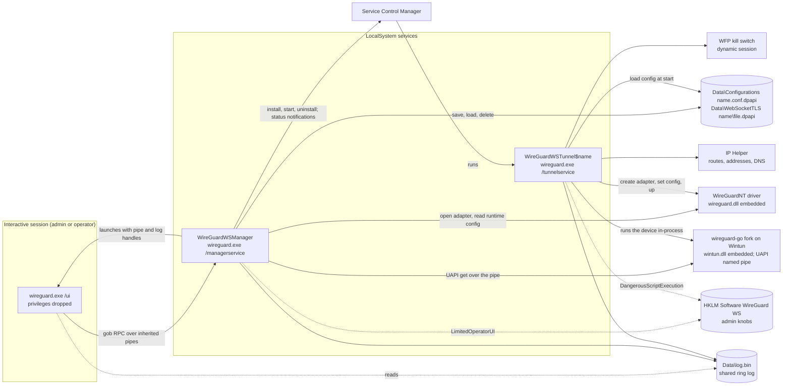
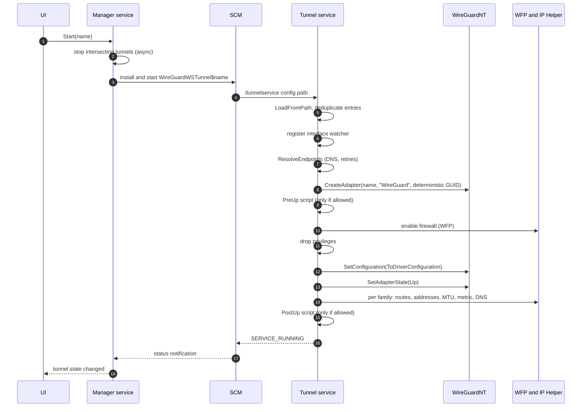
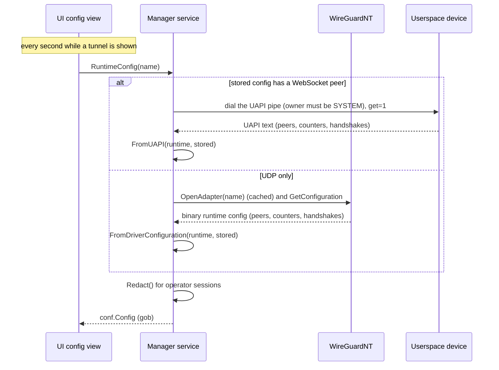
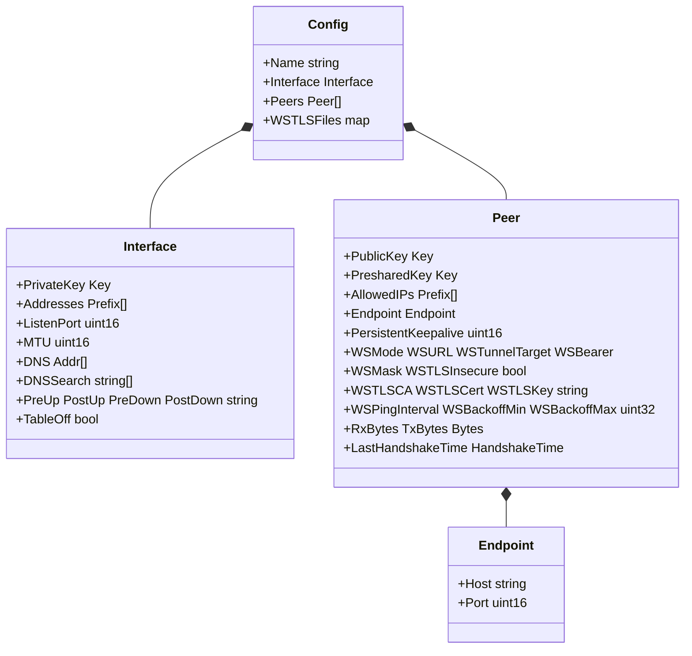
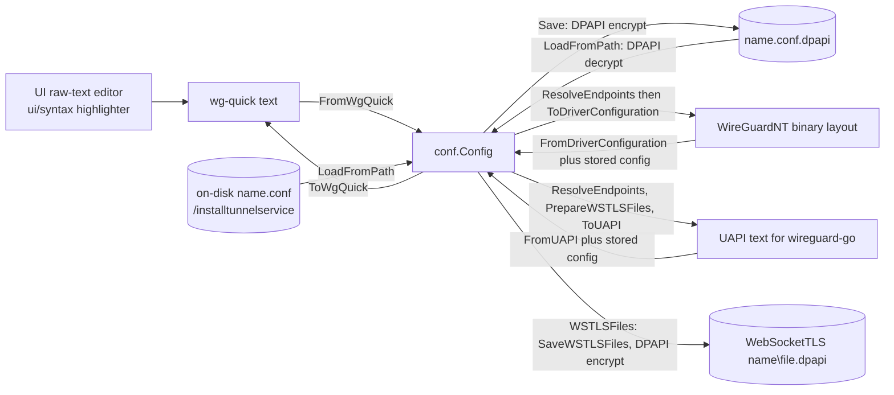
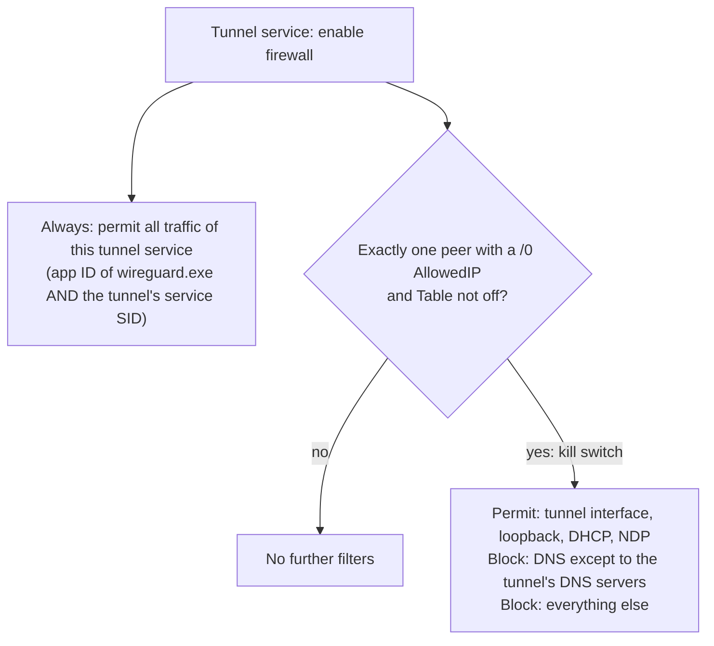
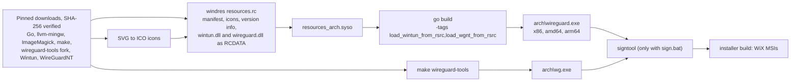
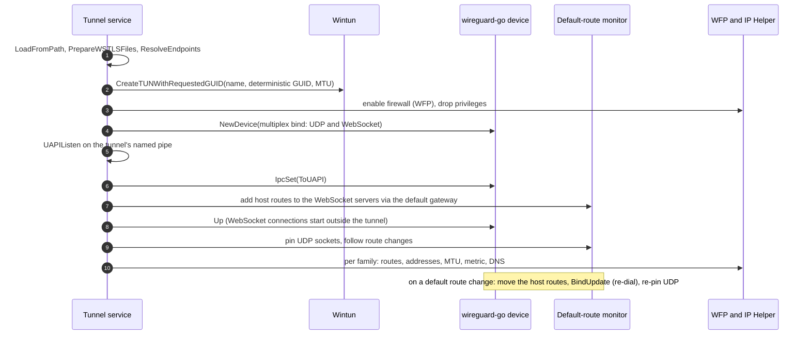

# wireguard-windows — Architecture

This document describes how `wireguard.exe` (WireGuard WS) is structured at runtime and build time,
including the userspace path that carries WebSocket peers. Security rationale lives in [`attacksurface.md`](attacksurface.md);
routing and kill-switch details in [`netquirk.md`](netquirk.md); project facts and decisions in
[`PROJECT.md`](PROJECT.md).

## 1. Processes & privilege boundaries

One executable runs in three roles. Only the services are privileged; the UI runs with its privileges
dropped and talks exclusively to the manager.

- **Manager** (`manager/`): installs itself as `WireGuardWSManager`; for every admin session (and operator
  session when `LimitedOperatorUI` is set) it creates the IPC pipes and launches the UI. It owns the
  config store, starts/stops tunnels, tracks tunnel services through SCM notifications, and serves
  runtime statistics. Operator sessions receive redacted configs and cannot mutate state.
- **Tunnel service** (`tunnel/`): one per running tunnel (`WireGuardWSTunnel$<name>`, LocalSystem,
  unrestricted service SID, depends on `Nsi` and `TcpIp`). It configures WireGuardNT, or runs the
  userspace device for a config with a WebSocket peer (section 7), sets up networking and the firewall,
  then drops all privileges except `SeLoadDriverPrivilege`.
- **Identity**: the service names above, the data directory `%ProgramFiles%\WireGuard WS\Data`, the
  admin key `HKLM\Software\WireGuard WS` and the management window class differ from the official
  client's, so both can be installed side by side.
- **UI** (`ui/`): walk-based tray + management window; never talks to tunnel services or the driver.
- **Start/stop semantics**: *Start* stops any running tunnel whose routes intersect the new one, then
  installs and starts its tunnel service; *Stop* uninstalls the tunnel service.

## 2. Tunnel bring-up (WireGuardNT)

Tear-down runs the PreDown script, flushes routes, addresses, and DNS, removes the firewall filters,
closes the adapter, and runs PostDown.

## 3. Runtime statistics

Interface fields the backend does not hold (addresses, DNS, MTU, scripts, table) come from the stored
config. Peers are rebuilt from runtime data; a userspace peer's WebSocket settings are copied from the
stored config, because the device reports the decrypted TLS file paths it was given.

## 4. Config data model & serialization surfaces

The parser rejects unknown keys, so every new key must be added to the model, the parser, the writer,
the highlighter, and the config view together. The WebSocket keys and their validation mirror the
Android and Apple clients (see [`PROJECT.md`](PROJECT.md)).

**TLS files.** In a stored tunnel, `WSTLSCA`, `WSTLSCert` and `WSTLSKey` are bare file names. When the
editor saves or the importer imports a config, the unprivileged UI reads each referenced file (an
absolute path, a path next to the imported `.conf`, or an entry of the imported zip), tells the user
which files it copied, and sends the contents with the config (`Config.WSTLSFiles`). The manager
validates them and stores each DPAPI-encrypted in `Data\WebSocketTLS\<tunnel>\`; `StoredConfig`
returns them to administrators only, so edits, renames and zip exports keep them. At start the tunnel
service decrypts them into `Data\WebSocketTLS\$runtime\<tunnel>\`, readable by SYSTEM only, and
removes them at stop; they are deleted with the tunnel. A config started from disk with
`/installtunnelservice` must use absolute local paths, which are read in place; relative, UNC and
device paths are rejected.

## 5. Firewall, kill switch & routing

- The permit rule is scoped by application and service SID, not by endpoint, so any connection the
  tunnel service makes, including the WebSocket connection, passes the kill switch.
- Routing-loop avoidance for UDP is done **inside WireGuardNT**: it tracks the routing table, picks the
  route that does not loop back into itself, and sends with `IP_PKTINFO`/`IPV6_PKTINFO`
  ([`netquirk.md`](netquirk.md)).
- For the userspace path the tunnel service does it itself (section 7): it pins the UDP sockets to the
  interface of the lowest-metric default route that is not the tunnel (`IP_UNICAST_IF`), and keeps a
  host route (`/32` or `/128`) to each WebSocket server through that route's gateway, so the TCP
  WebSocket connection never enters the tunnel. Other processes' traffic to those servers is not
  tunnelled either; with the kill switch on, WFP still blocks it.

## 6. Build pipeline

`build.bat` (Windows) runs the whole pipeline; the Linux `Makefile` runs the `wireguard.exe` part only.
Upstream's `.overlay` stubs of the standard library crypto are removed: they cannot build
`crypto/tls` (needed for `wss://`). `wintun/` holds a copy of the `golang.zx2c4.com/wintun`
bindings, replaced in `go.mod`, that loads `wintun.dll` from `RCDATA` through `driver/memmod`, like
`driver/` loads `wireguard.dll`.

## 7. Userspace path (WebSocket peers)

A config with at least one WebSocket peer runs in the tunnel service on the `danielealbano/wireguard-go`
fork over Wintun; a UDP-only config keeps the WireGuardNT path of sections 2 to 5.

Tear-down closes the pipe and the device (which removes the Wintun adapter), removes the host routes and
the decrypted TLS files, besides the common steps of section 2.
