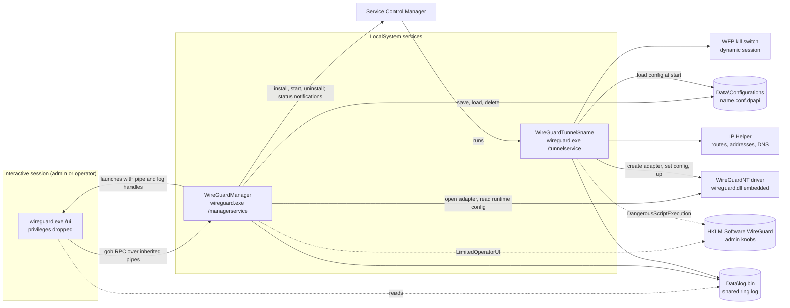
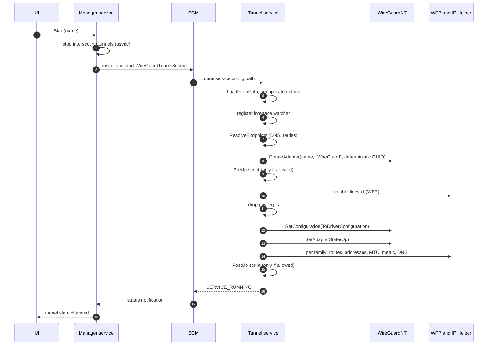
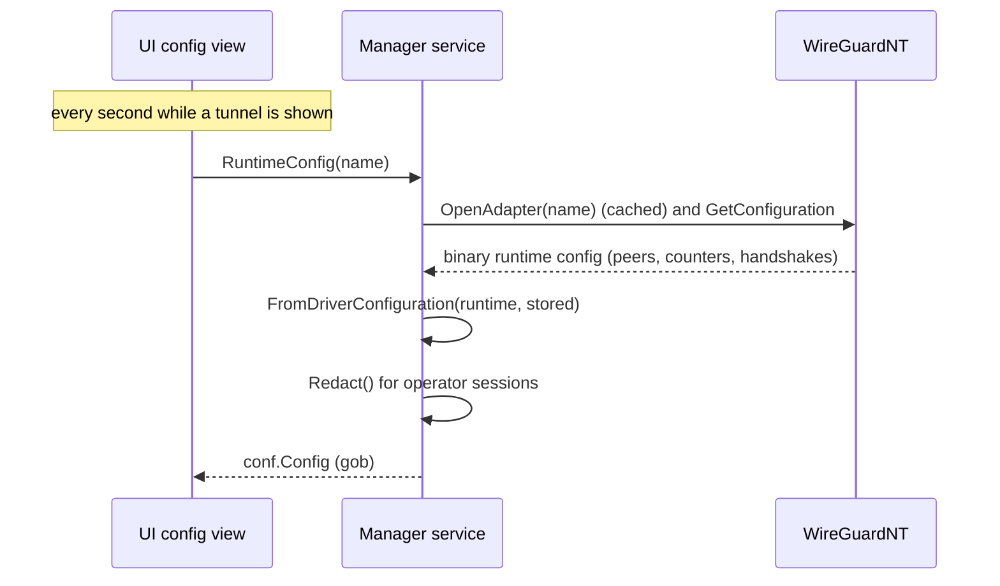
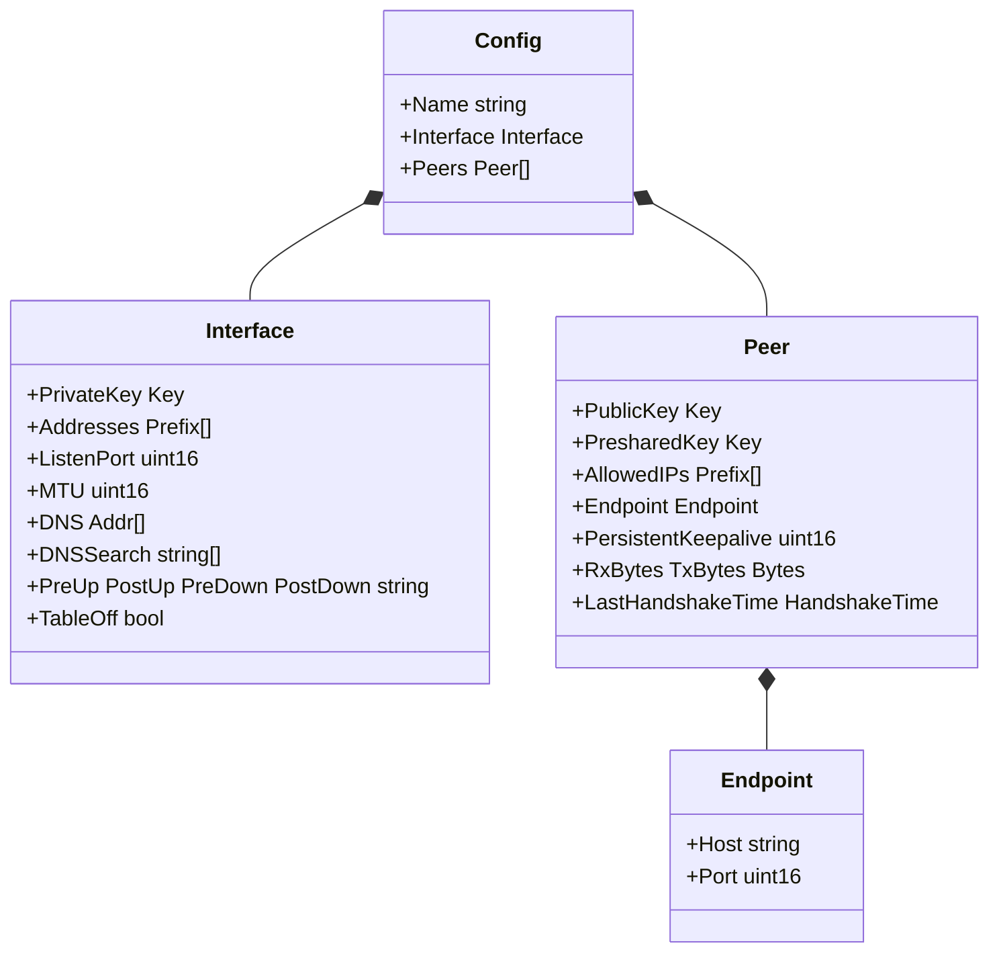
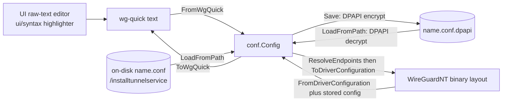
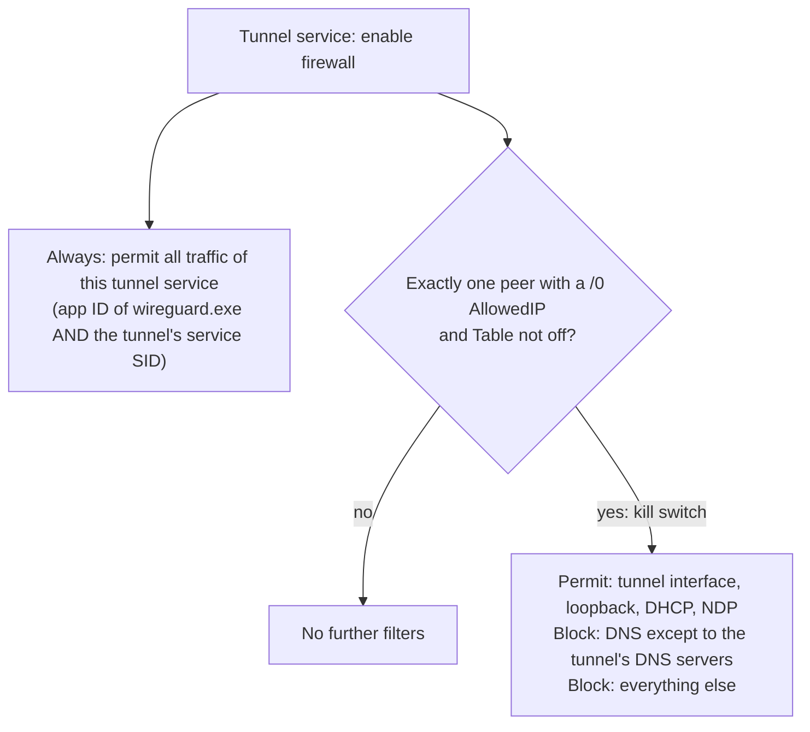
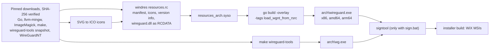
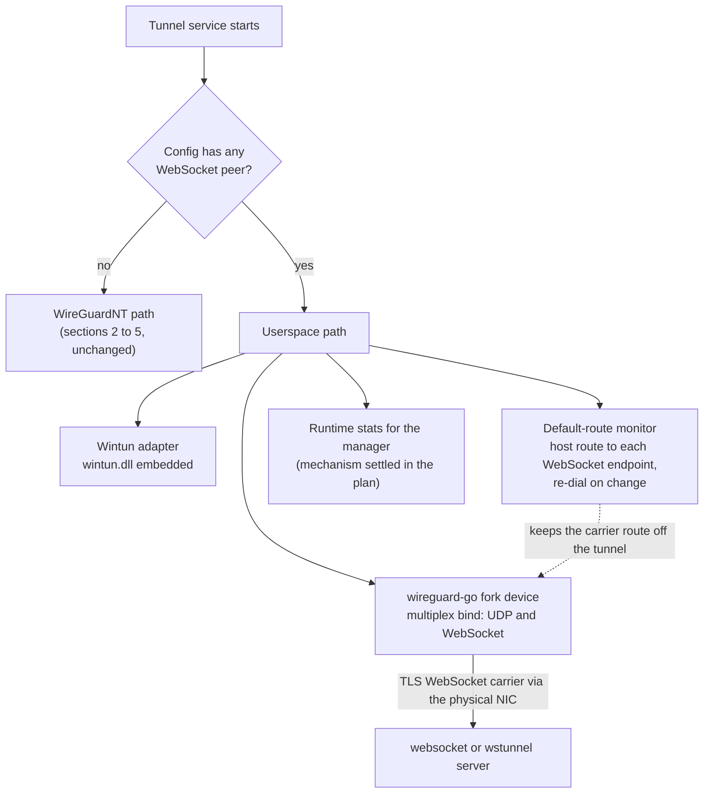

# wireguard-windows — Architecture

This document describes how `wireguard.exe` is structured at runtime and build time, and where the
fork's WireGuard WS work lands. Security rationale lives in [`attacksurface.md`](attacksurface.md);
routing and kill-switch details in [`netquirk.md`](netquirk.md); project facts and decisions in
[`PROJECT.md`](PROJECT.md).

## 1. Processes & privilege boundaries

One executable runs in three roles. Only the services are privileged; the UI runs with its privileges
dropped and talks exclusively to the manager.

- **Manager** (`manager/`): installs itself as `WireGuardManager`; for every admin session (and operator
  session when `LimitedOperatorUI` is set) it creates the IPC pipes and launches the UI. It owns the
  config store, starts/stops tunnels, tracks tunnel services through SCM notifications, and serves
  runtime statistics. Operator sessions receive redacted configs and cannot mutate state.
- **Tunnel service** (`tunnel/`): one per running tunnel (`WireGuardTunnel$<name>`, LocalSystem,
  unrestricted service SID, depends on `Nsi` and `TcpIp`). It configures the driver, networking, and
  firewall, then drops all privileges except `SeLoadDriverPrivilege`.
- **UI** (`ui/`): walk-based tray + management window; never talks to tunnel services or the driver.
- **Start/stop semantics**: *Start* stops any running tunnel whose routes intersect the new one, then
  installs and starts its tunnel service; *Stop* uninstalls the tunnel service.

## 2. Tunnel bring-up (WireGuardNT)

Tear-down runs the PreDown script, flushes routes, addresses, and DNS, removes the firewall filters,
closes the adapter, and runs PostDown.

## 3. Runtime statistics

Interface fields the driver does not hold (addresses, DNS, MTU, scripts, table) come from the stored
config; peers are rebuilt from driver data only.

## 4. Config data model & serialization surfaces

The parser rejects unknown keys, so every new key must be added to the model, the parser, the writer,
the highlighter, and the config view together.

## 5. Firewall, kill switch & routing

- The permit rule is scoped by application and service SID, not by endpoint, so any connection the
  tunnel service makes (including a future WebSocket carrier) passes the kill switch.
- Routing-loop avoidance for UDP is done **inside WireGuardNT**: it tracks the routing table, picks the
  route that does not loop back into itself, and sends with `IP_PKTINFO`/`IPV6_PKTINFO`
  ([`netquirk.md`](netquirk.md)). The Go code adds no host routes and binds no sockets today.

## 6. Build pipeline

`build.bat` (Windows) runs the whole pipeline; the Linux `Makefile` runs the `wireguard.exe` part only.

## 7. Where WireGuard WS lands (ROADMAP)

The agreed design (see [`PROJECT.md`](PROJECT.md) → Roadmap) selects the backend per tunnel inside the
tunnel service:

Supporting changes: the config model, parser, writer, highlighter, and config view gain the WebSocket
keys; certificate files are copied into the store DPAPI-encrypted for UI-managed tunnels; the product
gets its own "WireGuard WS" identity so it installs alongside the official client.
